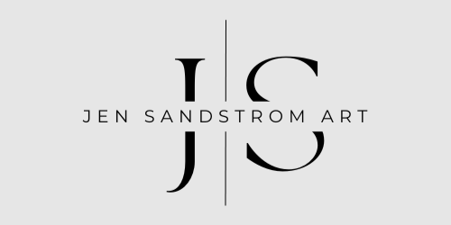

<div align="center">
  
  <h1>Website for Jen Sandstrom Art</h1>
  <p>A website to showcase the beautiful artwork by Jen Sandstrom.</p>
</div>

## Table of Contents

- [Getting Started](#getting-started)
- [Usage](#usage)
- [Contributing](#contributing)
- [Contact](#contact)
- [Acknowledgements](#acknowledgements)

## Getting Started

### Prerequisites

- npm

```bash
npm install --global npm
```

### Installation

1. Clone the repo

```bash
git clone https://github.com/your-username/your-project.git
```

2. Install dependencies

```bash
npm install
```

3. Start the server

```bash
npm start
```

## Usage

This project showcases the artwork of Jen Sandstrom. Navigate through different galleries, learn about the artist, and explore her creative journey.

## Contact

Your Name - [@your_twitter](https://twitter.com/your_twitter) - your_email@example.com

Project Link: [https://github.com/your-username/your-project](https://github.com/ur-username/your-project)